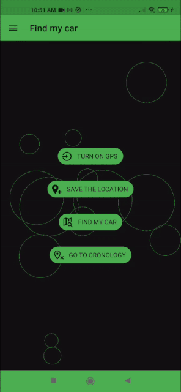
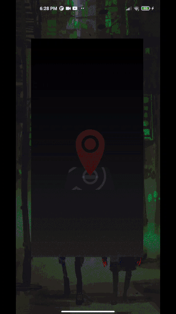

# Car-locator

Car locator android app created with kivy/kivymd

## How to build

If you want to build this app (last version) your self, you'll have to set p4a = develop in buildozer.spec if it doesent compile is due to https://github.com/kivy/kivy/issues/7398 and likely you'll have to make changes at your own. (Manualy add lottie support to your project).

else if you want to build previus version of the app just rename main.py to something else and main_with_circle_animation.py to main.py
then buildozer android build.

Otherwise already built app can be found in the bin folder.

### requirements:

The app in the bin folder was built with kivy==2.0.0 and kivymd==0.402.2.dev0 and modifyed version of python for android because of the above issue.

All other requirements can be found in buildozer.spec file

## Version 0.1.2

Added shader animation instead of simple circles and lottie animation instead of static preplash image

